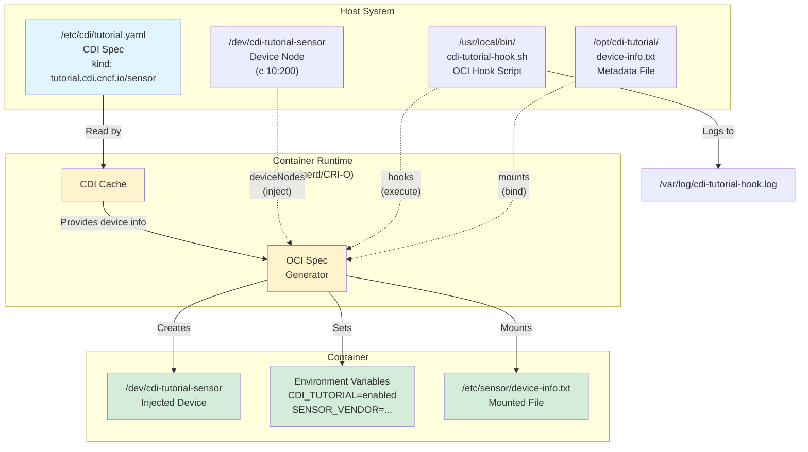

# CDI Tutorial: Hands-on with a Pseudo Character Device

## Motivation

This is a hands-on tutorial that walks users through the complete CDI lifecycle using a **pseudo character device** - no special hardware required.
By the end, users will understand how CDI specs are authored, validated, and consumed by container runtimes.

## Goals

- Provide a **reproducible, copy-paste-able** tutorial that works on Linux
- Demonstrate **major CDI spec features**: `deviceNodes`, `env`, `mounts`, and `hooks`
- Use the `cdi` command line interface for validation and inspection
- Support both Docker (≥ 25.0) and Podman (≥ 4.1) as container runtimes
- Keep prerequisites minimal: Linux host + a CDI-enabled container runtime

## Key Concept: CDI Specs and OCI Specs

A CDI Spec is simply a formal way to describe a **limited set of changes to an [OCI Spec](https://github.com/opencontainers/runtime-spec)**, to be applied during container creation.
Only a limited subset of the OCI Spec can be modified through CDI - specifically device nodes, mounts, hooks, and environment variables.
If something is not part of the OCI Spec, it is definitely not part of CDI either.

Keep this in mind throughout the tutorial: every CDI feature you see below (`deviceNodes`, `env`, `mounts`, `hooks`) maps directly to a field in the OCI runtime specification.
CDI does not invent new container primitives - it reuses existing OCI ones and provides a vendor-driven way to inject them.

## Tutorial

### Overview



### Prerequisites

- Linux host (Ubuntu 22.04+ or Fedora 38+ recommended)
- Container runtime with CDI support: see more details for [How to Configure CDI](./README.md#how-to-configure-cdi).
- Root or sudo access (for creating device nodes and writing to `/etc/cdi`)

### Walk-Through

- Create a Pseudo Character Device on the Host

  Use the kernel's `misc` device or `mknod` to create a simple character device that the tutorial will expose to containers.

  ```console
  # Pick an unused major/minor pair. Major 10 is misc devices.
  # We'll use minor 200 (check /proc/devices and /proc/misc to avoid conflicts).
  $ sudo mknod /dev/cdi-tutorial-sensor c 10 200
  $ sudo chmod 660 /dev/cdi-tutorial-sensor
  $ sudo chown root:root /dev/cdi-tutorial-sensor
  $ ls -la /dev/cdi-tutorial-sensor
  ```

- Create a Hook Script

  CDI allows injecting [OCI lifecycle hooks](https://github.com/opencontainers/runtime-spec/blob/main/config.md#posix-platform-hooks) into the OCI Spec. These hooks run at container creation time and can perform device-specific setup.
  We'll create a simple hook script that logs the injection event and optionally adjusts device permissions.

  ```bash
  $ sudo mkdir -p /usr/local/bin
  $ sudo tee /usr/local/bin/cdi-tutorial-hook.sh << 'HOOKEOF'
  #!/bin/bash
  # CDI Tutorial — OCI hook that runs during container creation
  # This OCI hook receives the OCI bundle path via stdin (as JSON)
  LOGFILE="/var/log/cdi-tutorial-hook.log"
  TIMESTAMP=$(date -u +"%Y-%m-%dT%H:%M:%SZ")
  echo "${TIMESTAMP} CDI tutorial hook invoked with args: $@" >> "${LOGFILE}"
  # Read the OCI state from stdin
  OCI_STATE=$(cat)
  echo "${TIMESTAMP} OCI state: ${OCI_STATE}" >> "${LOGFILE}"
  # Example: ensure the device has correct permissions inside the container
  # In a real scenario, this could set up symlinks, update ldcache, etc.
  BUNDLE_PATH=$(echo "${OCI_STATE}" | grep -o '"bundle":"[^"]*"' | cut -d'"' -f4)
  if [ -n "${BUNDLE_PATH}" ]; then
      echo "${TIMESTAMP} Bundle path: ${BUNDLE_PATH}" >> "${LOGFILE}"
  fi
  echo "${TIMESTAMP} Hook completed successfully" >> "${LOGFILE}"
  exit 0
  HOOKEOF
  $ sudo chmod 755 /usr/local/bin/cdi-tutorial-hook.sh
  ```

- Create a Shared Library Mount (Optional Demo Asset)

  To demonstrate the `mounts` feature, create a simple shared file that will be bind-mounted into the container:

  ```console
  $ sudo mkdir -p /opt/cdi-tutorial
  $ sudo tee /opt/cdi-tutorial/device-info.txt << 'EOF'
  CDI Tutorial Pseudo Sensor v1.0
  Vendor: tutorial.cdi.cncf.io
  Capabilities: temperature, humidity
  EOF
  ```

- Write the CDI Spec

  Now create the CDI specification that ties everything together:

  ```console
  $ sudo mkdir -p /etc/cdi
  $ sudo tee /etc/cdi/tutorial.yaml << 'SPECEOF'
  ---
  cdiVersion: "1.1.0"
  kind: "tutorial.cdi.cncf.io/sensor"
  devices:
    - name: "temp0"
      containerEdits:
        deviceNodes:
          - path: "/dev/cdi-tutorial-sensor"
            hostPath: "/dev/cdi-tutorial-sensor"
            type: "c"
            major: 10
            minor: 200
            fileMode: 432  # 0660 in decimal
            permissions: "rw"
    - name: "temp1"
      containerEdits:
        deviceNodes:
          - path: "/dev/cdi-tutorial-sensor"
            hostPath: "/dev/cdi-tutorial-sensor"
            type: "c"
            major: 10
            minor: 200
            fileMode: 292  # 0444 in decimal
            permissions: "r"
  containerEdits:
    env:
      - "CDI_TUTORIAL=enabled"
      - "SENSOR_VENDOR=tutorial.cdi.cncf.io"
      - "SENSOR_VERSION=1.0"
    mounts:
      - hostPath: "/opt/cdi-tutorial/device-info.txt"
        containerPath: "/etc/sensor/device-info.txt"
        options:
          - "ro"
          - "nosuid"
          - "nodev"
          - "bind"
    hooks:
      - hookName: "createContainer"
        path: "/usr/local/bin/cdi-tutorial-hook.sh"
        args:
          - "cdi-tutorial-hook.sh"
          - "--device"
          - "tutorial-sensor"
  SPECEOF
  ```

  **Key things to note about this spec:**

  - **`kind`**: `tutorial.cdi.cncf.io/sensor` - must follow the `vendor.com/class` naming convention, which is a CDI Spec requirement enforced syntactically during spec validation
  - **Two devices**: `temp0` (read-write) and `temp1` (read-only) show how the same physical device can be exposed with different permissions
  - **`containerEdits` at the top level**: Applied whenever *any* device from this spec is requested - sets environment variables, mounts device metadata, and runs the hook
  - **`containerEdits` at the device level**: Device-specific edits (the device node itself)
  - **`hooks`**: Injects a `createContainer` OCI hook that runs our script during container creation

- Validate the CDI Spec with the `cdi` CLI

  Use the `cdi` tool to validate the spec and list available devices:

  ```console
  $ cdi validate /etc/cdi/tutorial.yaml
  No CDI cache errors.
  $ cdi devices
  CDI devices found:
  0. tutorial.cdi.cncf.io/sensor=temp0
  1. tutorial.cdi.cncf.io/sensor=temp1
  ```

- Run a Container with the CDI Device

  ```console
  $ docker run --rm -it --device tutorial.cdi.cncf.io/sensor=temp0 ubuntu:22.04 bash
  ```

- Verify CDI Spec Works Inside the Container

  Once inside the container, verify each CDI feature:

  ```console
  $ echo $CDI_TUTORIAL
  enabled
  $ echo $SENSOR_VENDOR
  tutorial.cdi.cncf.io
  $ echo $SENSOR_VERSION
  1.0
  $ ls -la /dev/cdi-tutorial-sensor
  crw-rw---- 1 root root 10, 200 Feb 20 06:12 /dev/cdi-tutorial-sensor
  $ cat /etc/sensor/device-info.txt
  CDI Tutorial Pseudo Sensor v1.0
  Vendor: tutorial.cdi.cncf.io
  Capabilities: temperature, humidity
  $ exit
  ```

  Back on the host, verify the OCI hook ran:

  ```console
  $ cat /var/log/cdi-tutorial-hook.log
  2026-02-20T06:12:47Z CDI tutorial hook invoked with args: --device tutorial-sensor
  2026-02-20T06:12:47Z OCI state: {"ociVersion":"1.2.1","id":"628bd99f4306c169fe6206e3b74a5b093e0cec0bb40e0a3119f6918b66340c00","status":"creating","pid":1,"bundle":"/run/containerd/io.containerd.runtime.v2.task/moby/628bd99f4306c169fe6206e3b74a5b093e0cec0bb40e0a3119f6918b66340c00"}
  2026-02-20T06:12:47Z Bundle path: /run/containerd/io.containerd.runtime.v2.task/moby/628bd99f4306c169fe6206e3b74a5b093e0cec0bb40e0a3119f6918b66340c00
  2026-02-20T06:12:47Z Hook completed successfully
  ```

- Experiment - Request the Read-Only Device

  ```console
  $ docker run --rm -it --device tutorial.cdi.cncf.io/sensor=temp1 ubuntu:22.04 bash
  $ ls -la /dev/cdi-tutorial-sensor
  cr--r--r-- 1 root root 10, 200 Feb 20 06:17 /dev/cdi-tutorial-sensor
  $ echo "test" > /dev/cdi-tutorial-sensor
  bash: echo: write error: File descriptor in bad state
  ```

- Cleanup

  ```console
  $ sudo rm /etc/cdi/tutorial.yaml /dev/cdi-tutorial-sensor
  $ sudo rm /usr/local/bin/cdi-tutorial-hook.sh
  $ sudo rm -rf /opt/cdi-tutorial
  $ sudo rm -f /var/log/cdi-tutorial-hook.log
  ```
